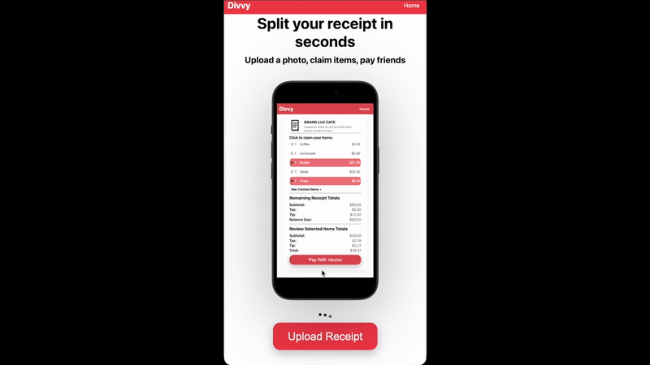
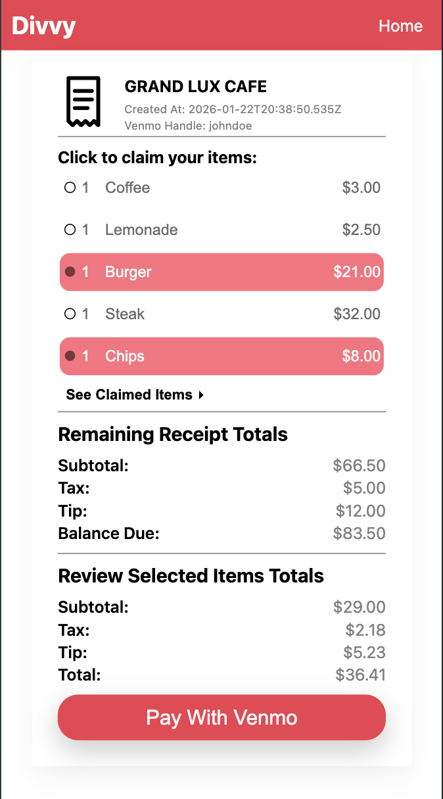
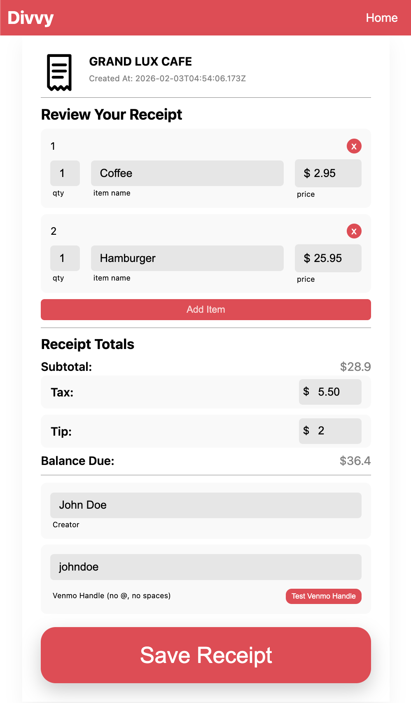

# Dinner Splitter

A mobile-first web app that lets groups instantly split a restaurant bill.

Upload a receipt → auto-parse items → friends claim what they ordered → pay instantly with Venmo.

Built as a full-stack production app with OCR + LLM parsing.

## Live Demo
https://usedivvy.app

## Demo

### Full Flow (upload → parse → claim → pay)

### Screenshots

---

## Why this project exists

Splitting restaurant bills manually is slow and error-prone.
Dinner Splitter automates the entire process from receipt photo to payment links — no accounts required.

Users simply share a link and claim their items.

---

## Key Features

- Receipt photo upload
- Automatic text extraction with OCR
- LLM-based parsing into structured line items
- Item-by-item claiming via shareable link
- Automatic tax and tip splitting
- Venmo deep links for instant payments
- Mobile-first responsive UI
- No login required

---

## Tech Stack

### Frontend
- React (Vite)

### Backend
- Node.js
- Express
- PostgreSQL

### APIs
- Google Vision (OCR)
- OpenAI (receipt parsing / cleanup)

### Infrastructure
- Render (backend hosting)
- AWS RDS (managed database)
- Vercel (static frontend hosting)

---

## Engineering Highlights

- Designed relational schema for receipts, items, participants, and claims
- Built OCR → LLM processing pipeline to convert messy receipt text into structured data
- Implemented share-token participation system (no authentication required)
- Integrated Venmo deep links for one-tap payments
- Deployed production backend and database
- Handles concurrent item claims safely

## Project Structure
client/ React frontend
server/ Express backend

---

## Run Locally

### Client
cd client
npm install
npm run dev

### Server

cd server
npm install
npm run dev

